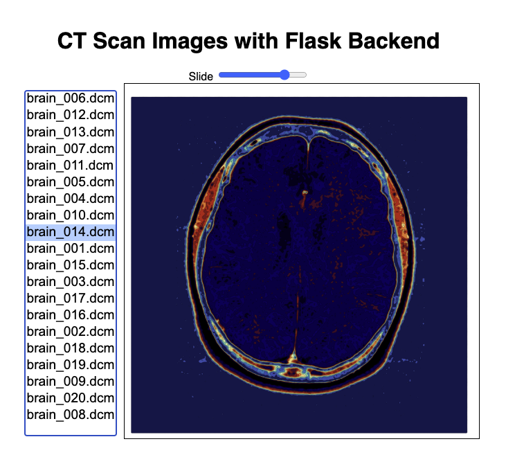

# CT Scan Viewer Flask App

## Description
This Flask application allows users to view CT scan images through a web interface. It includes a simple slider for navigating through different slices of brain scans.


## Features
- Displays a list of CT scan images (in DICOM format).
- Allows users to select and view a particular slice of the brain.
- Backend implemented with Flask in Python.

## Installation

To run this application on your local machine, you'll need Python and Flask. Follow these steps to get started:

1. Clone the repository:
```
git clone [URL to your repo]
```

2. Navigate to the cloned repository:

```
cd [Your repository name]
```
3. Install the required Python packages:
```
pip install -r requirements.txt
```

* Note: This assumes you have a requirements.txt file listing the necessary packages, including Flask and PyDICOM

## Usage
To start the server, run:

```
python app.py
```
Once the server is running, you can access the application by navigating to http://localhost:5000 in your web browser.


## API Endpoints
/ - The main page that renders the index.html template.
/data - API endpoint to get the pixel data for a specific CT scan image, specified by the file query parameter.
/files - API endpoint to get a list of all DICOM files available.

## Contributing
If you would like to contribute to this project, please fork the repository and submit a pull request.

## License
Include a license here, typically MIT or another open-source license.
